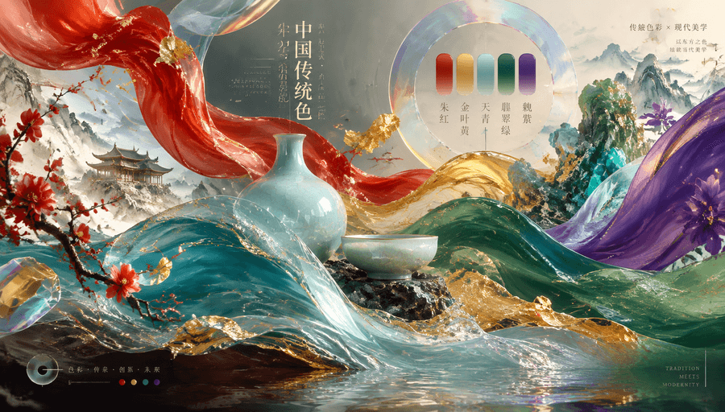
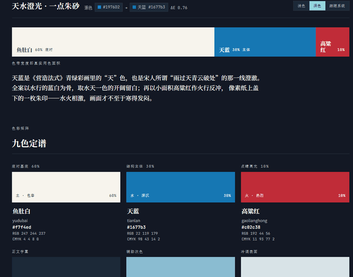
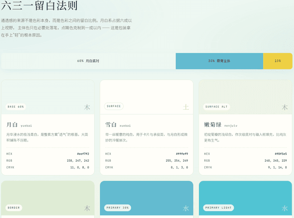

# 中国传统色配色技能 (doudou-color)

<p align="center">
  
</p>

> **基于 526 种中国传统色构建的资深色彩专家 Skill**

> 融合东方五行色彩哲学与现代色彩和弦理论，提供数字 UI/UX、品牌包装印刷与视觉海报的专业色彩方案。

---

## 📑 目录导航

- [📖 技能使用指南](#-技能使用指南)
  - [一、安装](#一安装)
  - [二、使用](#二使用)
- [🌟 核心特性](#-核心特性)
- [💬 交流与支持](#-交流与支持)

---

## 📖 技能使用指南

本技能作为 **AI Agent 的专业色彩大脑**（支持 Antigravity、Claude Code、OpenCode 等）。

---

### 一、安装

在任何目标工程根目录下，通过命令行一键安装：

```bash
npx skills add undsky/doudou-color-skill --yes
```

---

### 二、使用

不需要懂专业色彩术语，直接用大白话告诉 AI 你想做什么、想要什么感觉即可：

#### 场景 1：唯美炫丽视觉 / 大胆撞色吸睛

> _“我想做一组唯美炫丽的视觉海报，希望用强烈的撞色形式凸显色彩冲击力，帮我搭一套高级惊艳的国风撞色组合！”_


[查看DEMO](https://htmlpreview.github.io/?https://github.com/undsky/doudou-color-skill/blob/master/demo/demo1.html)

#### 场景 2：手里有个颜色，想找国风搭配

> _“我喜欢这个蓝色 #1976D2，再帮我搭几个好看的颜色。”_


[查看DEMO](https://htmlpreview.github.io/?https://github.com/undsky/doudou-color-skill/blob/master/demo/demo2.html)

#### 场景 3：清新自然 / 明快轻盈治愈

> _“我想做一款清新明快、轻盈治愈的文创包装，想要那种通透又有呼吸感的效果，帮我搭配一组明朗干净的中国传统色！”_


[查看DEMO](https://htmlpreview.github.io/?https://github.com/undsky/doudou-color-skill/blob/master/demo/demo3.html)

---

## 🌟 核心特性

1. **权威数据源**：
   - 内置 526 种经典中国传统色 (`colors.json`)，包含中文雅称、汉语拼音、十六进制 HEX、RGB 屏幕色彩以及四色印刷 CMYK 标定。
2. **科学与感知色彩匹配**：
   - 基于 **RGB -> XYZ -> CIE LAB** 空间转换及 **Delta-E (CIE76)** 最小色距算法，可将任意现代 HEX 颜色精准对应至最吻合的中国传统正色。
   - 内置常见国色文人雅称同义词映射表（如天青、玄青、朱砂、竹青、霁蓝等）。
3. **东方美学与现代和弦推导**：
   - 支持互补色（Complementary）、相邻色（Analogous）、三合色（Triadic）、分裂互补（Split-Complementary）与同色阶梯（Monochromatic）计算。
   - 融合五行五色相生相克（青木、赤火、黄土、白金、黑水）与传统器物釉色（汝窑天青、宣德炉皮色、千里江山青绿、故宫金碧）。
4. **数字 UI/UX 工程落地**：
   - 自动生成符合 **60-30-10 黄金比例** 的现代界面方案（背景底色、卡片表面、品牌主色、辅助色、点睛色、正文及次要文字）。
   - 内置 **WCAG 2.1 AA/AAA 级无障碍阅读对比度检验**。
   - 一键导出浅色（Light）与深色（Dark）模式的 CSS Design Tokens。

---

## 💬 交流与支持

| 公众号                                       | QQ群                                          |
| -------------------------------------------- | --------------------------------------------- |
|  |  |
